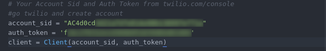

this script allow you to supervise your temperature sensor
--
/i\ __tested on Debian family__ 

### what you need

	* python3

### how  to install ?

1-download the script on repository  [click here](https://github.com/Diallomm/temperature-sensor-alert/archive/master.zip)

2- download twilio package
	
	pip3 install twilio
	
3 - create twilio account on [here](https://www.twilio.com/try-twilio)  and take your API key 	

add this on your code

4-if you want to run this script any time add this on crontab (recommended for supervisor any time )

	crontab -e
	
	@reboot /usr/bin/python3 "directory where is a script"
	
  or
  use python3 to run script
  			
  	python3  temperature-sensor-alert.py 

after normally all is work, if you have a problem contact me
      